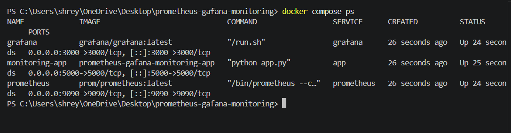
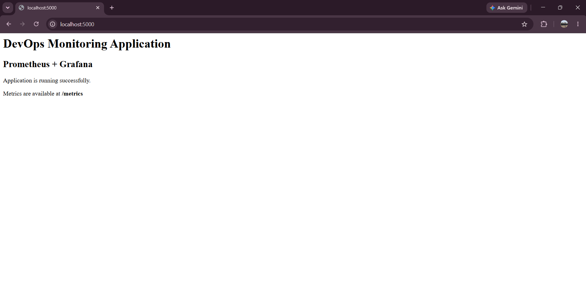
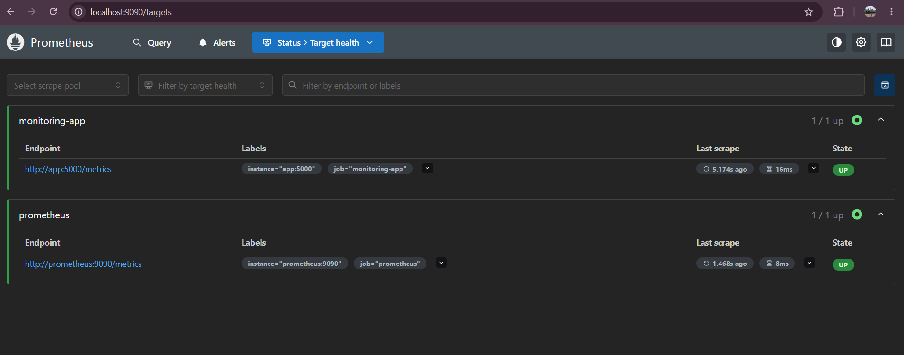
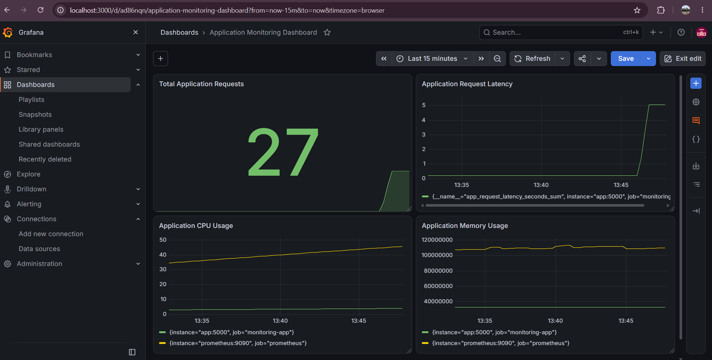

# 📊 Prometheus & Grafana Application Monitoring

A DevOps monitoring project that demonstrates how to monitor a **Python Flask application** using **Prometheus, Grafana, Docker, and Docker Compose**.

Prometheus collects application metrics, while Grafana provides a dashboard to visualize requests, latency, CPU usage, and memory usage.

---

## 🚀 Project Overview

The main purpose of this project is to understand how application monitoring works in a DevOps environment.

The Flask application exposes metrics through a `/metrics` endpoint. Prometheus regularly collects these metrics, and Grafana uses Prometheus as a data source to display the collected information through monitoring dashboards.

All services run in Docker containers and are managed using Docker Compose.

---

## 🛠️ Technologies Used

- Python
- Flask
- Prometheus
- Grafana
- Docker
- Docker Compose
- Git
- GitHub

---

## 🏗️ Project Architecture

```text
          User
            │
            ▼
    Flask Application
       Port 5000
            │
            ▼
    /metrics Endpoint
            │
            ▼
       Prometheus
       Port 9090
            │
            ▼
         Grafana
       Port 3000
            │
            ▼
   Monitoring Dashboard
```

---

## 📁 Project Structure

```text
prometheus-grafana-monitoring/
│
├── app/
│   ├── app.py
│   ├── Dockerfile
│   └── requirements.txt
│
├── prometheus/
│   └── prometheus.yml
│
├── Documents/
│   ├── 01-docker-containers-running.png
│   ├── 02-monitoring-app-running.png
│   ├── 03-prometheus-target-up.png
│   └── 04-Grafana-Monittoring_dashboard.png
│
└── docker-compose.yml
```

---

## ⚙️ How It Works

1. The Flask application runs inside a Docker container.
2. The application exposes monitoring metrics through the `/metrics` endpoint.
3. Prometheus collects the metrics from the application.
4. Grafana is connected to Prometheus as a data source.
5. Grafana converts the collected metrics into easy-to-understand graphs and panels.
6. Docker Compose is used to run the application, Prometheus, and Grafana together.

---

## 📈 Metrics Monitored

The Grafana dashboard contains four main monitoring panels:

### 1. Total Application Requests

Displays the total number of requests received by the Flask application.

### 2. Application Request Latency

Displays information about the time taken to process application requests.

### 3. Application CPU Usage

Displays CPU-related process metrics collected by Prometheus.

### 4. Application Memory Usage

Displays the memory used by the monitored processes.

---

# 📸 Project Screenshots

## 1. Docker Containers Running

The Flask application, Prometheus, and Grafana services are running using Docker.



---

## 2. Monitoring Application Running

The Flask monitoring application is successfully running locally.



---

## 3. Prometheus Target Status

Prometheus successfully detects the configured monitoring target and shows its status as **UP**.



---

## 4. Grafana Monitoring Dashboard

The final Grafana dashboard displays application requests, request latency, CPU usage, and memory usage.



---

## 🌐 Local Services

| Service | Local Address |
|---|---|
| Flask Application | `http://localhost:5000` |
| Application Metrics | `http://localhost:5000/metrics` |
| Prometheus | `http://localhost:9090` |
| Grafana | `http://localhost:3000` |

---

## ▶️ How to Run the Project

### 1. Clone the Repository

```bash
git clone https://github.com/shreyansh234/prometheus-grafana-monitoring.git
```

### 2. Enter the Project Directory

```bash
cd prometheus-grafana-monitoring
```

### 3. Start Docker Desktop

Make sure Docker Desktop is running on your system.

### 4. Build and Start the Services

```bash
docker compose up -d --build
```

### 5. Check Running Containers

```bash
docker ps
```

### 6. Open the Flask Application

```text
http://localhost:5000
```

### 7. View Application Metrics

```text
http://localhost:5000/metrics
```

### 8. Open Prometheus

```text
http://localhost:9090
```

### 9. Open Grafana

```text
http://localhost:3000
```

---

## 🔄 Monitoring Workflow

```text
Application Request
        ↓
Flask Application
        ↓
Metrics Generated
        ↓
/metrics Endpoint
        ↓
Prometheus Scrapes Metrics
        ↓
Grafana Reads Prometheus Data
        ↓
Monitoring Dashboard
```

---

## 🎯 What I Learned

Through this project, I learned:

- How application monitoring works
- How to expose application metrics
- How Prometheus collects metrics
- How to configure Prometheus targets
- How to connect Grafana with Prometheus
- How to create Grafana monitoring panels
- How to monitor application requests
- How to monitor request latency
- How to view CPU and memory metrics
- How Docker containers work
- How to use Docker Compose
- How multiple services communicate with each other
- How to manage source code using Git
- How to push and maintain a project on GitHub

---

## 💻 Useful Docker Commands

### Start the Project

```bash
docker compose up -d
```

### Stop the Project

```bash
docker compose down
```

### View Running Containers

```bash
docker ps
```

### Rebuild the Project

```bash
docker compose up -d --build
```

---

## 👨‍💻 Author

**Shreyansh Singh**

GitHub: [shreyansh234](https://github.com/shreyansh234)

LinkedIn: [Shreyansh Singh](https://www.linkedin.com/in/shreyansh01122006/)

---

## 📌 Project Purpose

This project was created as a practical DevOps project to understand the fundamentals of **application monitoring, metrics collection, visualization, containerization, Prometheus, Grafana, and Docker**.
